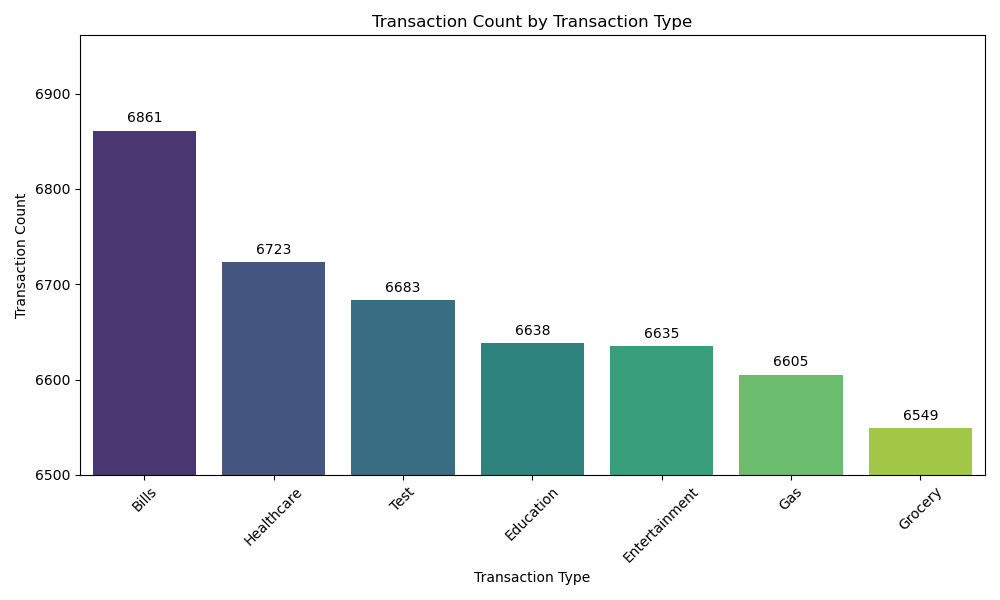
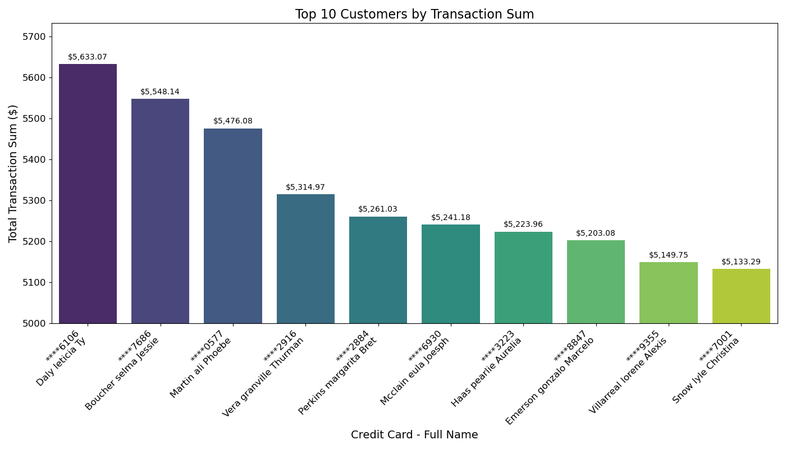
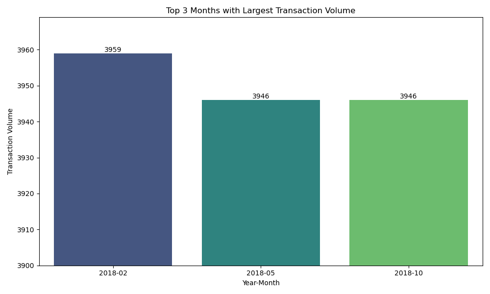

# Loan and Credit Card ETL Capstone Project

## Overview
This capstone project demonstrates the knowledge and abilities acquired throughout the Data Engineering course. The project involves managing an ETL process for a Loan Application dataset and a Credit Card dataset using Python, SQL, Apache Spark, and various Python libraries for data visualization and analysis.

This project involves the following steps:
1. Preprocessing of datasets (Loan Application and Credit Card).
2. Data extraction, transformation, and loading using Python (Pandas, advanced modules like Matplotlib, Seaborn, FPDF), SQL, and PySpark.
3. Creating a console-based application for data management and visualization.
4. Developing visualizations and analytics using Python libraries.

## Authors
- Chun-hao (Larry) Chen &nbsp; &nbsp; 

## Table of Contents
- [Business Problem Statement](#business-problem-statement)
- [Technologies Used](#technologies-used)
- [Project Structure](#project-structure)
- [Data Extraction and Transformation](#data-extraction-and-transformation)
- [Data Loading into Database](#data-loading-into-database)
- [Application Front-End](#application-front-end)
- [Data Analysis and Visualization](#data-analysis-and-visualization)

## Business Problem Statement

## Technologies Used
- Python (Pandas, Matplotlib, Seaborn, FPDF)
- SQL (MySQL)
- PySpark
- API

## Project Structure
- `data/`: Contains the JSON files for Credit Card dataset.
- `db/`: Contains the sql file for database creditcard_capstone 
- `src/`: Contains the Python scripts for data ETL process, application front-end, and data analysis and visualization.
- `report/`: Directory for saving generated reports.
- `image/`: Directory for saving visualizations.

## Data Extraction and Transformation
The project reads data from the JSON files and API:

1. JSON files:
    - `CDW_SAPP_BRANCH.JSON`
    - `CDW_SAPP_CREDITCARD.JSON`
    - `CDW_SAPP_CUSTOMER.JSON`
2. API Endpoint: https://raw.githubusercontent.com/platformps/LoanDataset/main/loan_data.json

Data extraction and transformation are performed using PySpark. Schemas are defined for each file, and data is read into Spark DataFrames.

## Data Loading into Database
Transformed data is loaded into a MySQL database named creditcard_capstone with the following tables:
- `CDW_SAPP_BRANCH`
- `CDW_SAPP_CREDIT_CARD`
- `CDW_SAPP_CUSTOMER`
- `CDW_SAPP_loan_application`

## Application Front-End
A console-based menu-driven application is created to interact with the data. The application includes the following modules:

### Transaction Details Module:
- Query transactions based on zip code and month-year.
- Display and export transactions.

https://github.com/user-attachments/assets/452a4f85-2337-4e48-9a01-b9ad00cba9b1

### Customer Details Module:
- Check and modify existing account details.
- Generate monthly bills and export to PDF and CSV.
- Display transactions between two dates and export to CSV.

https://github.com/user-attachments/assets/c7b90c11-1d54-49c8-84b9-3cd9486b3ae8

## Data Analysis and Visualization
The project includes several visualizations to analyze the data. Below are the visualizations created:

### Transaction Type Analysis

The count of transactions for different transaction types, with the top three being bills (6861), healthcare (6723), and test (6683).

### Top 10 States by Customer Count

The number of customers in the top 10 states, with New York (96) leading.

### Top 10 Customers by Transaction Sum

The total transaction sum for the top 10 customers, with Daly Leticia Fly ($5,633.07) having the highest transaction sum.

### Self-Employed Approval Percentage

The approval rate of loan applications for self-employed applicants, with 65.71% approved and 34.29% not approved.

### Married Male Rejection Percentage

The rejection rate of loan applications for married male applicants, with 28.43% rejected and 71.57% not rejected.

### Top Three Months by Transaction Volume

The top three months with the largest transaction volumes, showing February 2018 (3959), May 2018 (3946), and October 2018 (3946).

### The Branch with the Highest Healthcare Transactions Amount

The branch with the highest total value of healthcare transactions, with branch code 25 ($4,370.18) leading.

