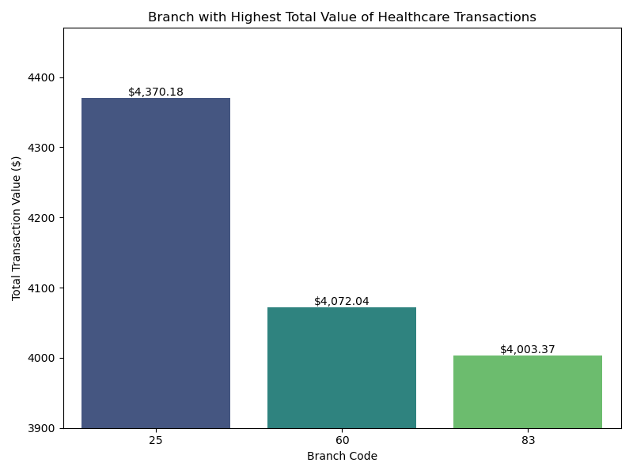

# Loan and Credit Card ETL Capstone Project

## Overview
This capstone project demonstrates the knowledge and abilities acquired throughout the Data Engineering course. The project involves managing an ETL process for a Loan Application dataset and a Credit Card dataset using Python, SQL, Apache Spark, and various Python libraries for data visualization and analysis.

This project involves the following steps:
1. Preprocessing of datasets (Loan Application and Credit Card).
2. Data extraction, transformation, and loading using Python (Pandas, advanced modules like Matplotlib, Seaborn, FPDF), SQL, and PySpark.
3. Creating a console-based application for data management and visualization.
4. Developing visualizations and analytics using Python libraries.

## Authors
- Chun-hao (Larry) Chen &nbsp; &nbsp; 

## Table of Contents
- [Business Use Case](#business-use-case)
- [Technologies Used](#technologies-used)
- [Project Workflow](project-workflow)
- [Project Structure](#project-structure)
- [Data Extraction and Transformation](#data-extraction-and-transformation)
- [Data Loading into Database](#data-loading-into-database)
- [Application Front-End](#application-front-end)
- [Data Analysis and Visualization](#data-analysis-and-visualization)
- [Reference](#reference)

## Business Use Case
Any financial institution that wants to improve operational efficiency and gain real-time customer insights can benefit from an optimized data processing pipeline like the one we built. This solution is particularly valuable for banks and credit card companies but can also be adapted for other industries dealing with large volumes of transactional data. Here are a couple of specific business use cases:

- Chase Bank (Banking) - Enhance fraud detection by implementing a real-time data processing pipeline with PySpark and Kafka.
- American Express (Credit Card Company) - Optimize customer targeting for marketing campaigns using an ETL pipeline and advanced analytics for customer segmentation.

## Technologies Used
- Python (Pandas, Matplotlib, Seaborn, FPDF)
- SQL (MySQL)
- PySpark
- API

## Project Workflow

## Project Structure
- `data/`: Contains the JSON files for Credit Card dataset.
- `db/`: Contains the sql file for database creditcard_capstone 
- `src/`: Contains the Python scripts for data ETL process, application front-end, and data analysis and visualization.
- `report/`: Directory for saving generated reports.
- `image/`: Directory for saving visualizations.

## Data Extraction and Transformation
The project reads data from the JSON files and API:

1. JSON files:
    - `CDW_SAPP_BRANCH.JSON`
    - `CDW_SAPP_CREDITCARD.JSON`
    - `CDW_SAPP_CUSTOMER.JSON`
2. API Endpoint: https://raw.githubusercontent.com/platformps/LoanDataset/main/loan_data.json

Data extraction and transformation are performed using PySpark. Schemas are defined for each file, and data is read into Spark DataFrames.

## Data Loading into Database
Transformed data is loaded into a MySQL database named creditcard_capstone with the following tables:
- `CDW_SAPP_BRANCH`
- `CDW_SAPP_CREDIT_CARD`
- `CDW_SAPP_CUSTOMER`
- `CDW_SAPP_loan_application`

Video shows database and tables in MySQL:

https://github.com/user-attachments/assets/a572fa62-11ad-408e-907b-d1488982cfbe

## Application Front-End
A console-based menu-driven application is created to interact with the data. The application includes the following modules:

### Transaction Details Module:
#### Functions:
- Query transactions based on zip code and month-year.
- Display and export transactions.

#### Demo video
https://github.com/user-attachments/assets/452a4f85-2337-4e48-9a01-b9ad00cba9b1

### Customer Details Module:
#### Functions:
- Check and modify existing account details.
- Generate monthly bills and export to PDF and CSV.
- Display transactions between two dates and export to CSV.

#### Demo video
https://github.com/user-attachments/assets/c7b90c11-1d54-49c8-84b9-3cd9486b3ae8

## Data Analysis and Visualization
The data analysis revealed key transaction patterns, with bills, healthcare, and test transactions being the most frequent. New York had the highest number of customers, while Daly Leticia Fly led in transaction sums. Loan approval rates for self-employed individuals were 65.71%, with 28.43% of married male applicants facing rejection. February, May, and October 2018 saw the highest transaction volumes, and branch code 25 handled the most healthcare transactions.

### Graphs: 
#### Transaction Type Analysis
The top transaction types are bills (6861), healthcare (6723), and tests (6683).

#### Top 10 States by Customer Count
New York leads with 96 customers.

#### Top 10 Customers by Transaction Sum
Daly Leticia Fly has the highest transaction sum of $5,633.07.

#### Self-Employed Approval Percentage
65.71% of loan applications from self-employed applicants are approved.

#### Married Male Rejection Percentage
28.43% of loan applications from married male applicants are rejected.

#### Top Three Months by Transaction Volume
February 2018 (3959), May 2018 (3946), and October 2018 (3946) have the highest transaction volumes.

#### The Branch with the Highest Healthcare Transactions Amount
Branch code 25 leads with a total value of $4,370.18 in healthcare transactions.

## Reference

